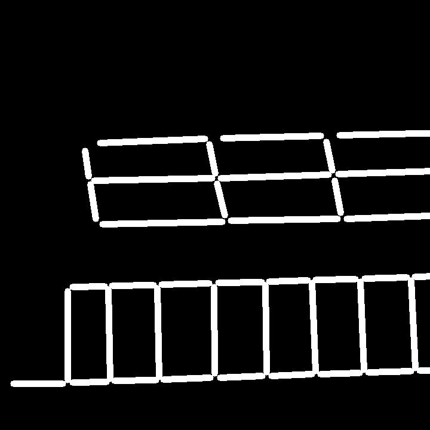
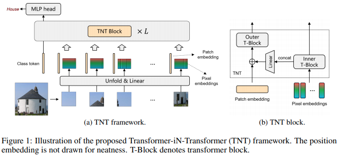
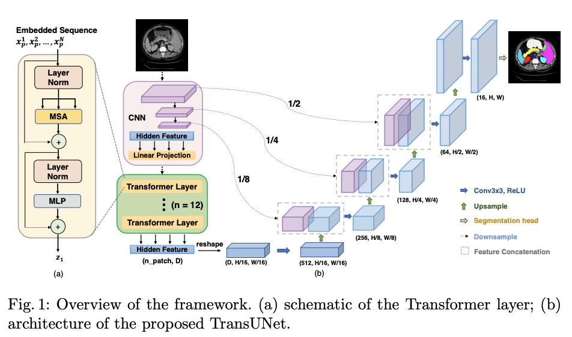

# TNTUnet

TNTUnet is a semantic segmentation model adopting TNT module and referencing TranUnet framework.

references github repos:
1. TransUnet : https://github.com/Beckschen/TransUNet.git
2. transformer-in-transformer (TNT) : https://github.com/lucidrains/transformer-in-transformer.git

TNTUnet framework

## Install

```bash
$ pip install -r requirements.txt
```

## Result

https://user-images.githubusercontent.com/35917050/166054922-7eab556e-0c70-49f0-a454-e035f6ede8e7.mp4

<!-- </img>
</img>
</img>
</img>
real || depth || mask || pred -->

## Transformer in Transformer

</img>

The framework of <a href="https://arxiv.org/abs/2103.00112">Transformer in Transformer</a>, pixel level attention paired with patch level attention for image classification, in Pytorch.

## TransUnet

</img>

The framework of <a href="https://arxiv.org/abs/1505.04597">TransUnet</a>, pixel level image semantic segmentation for image classification, in Pytorch.

<!-- ## Citations

```bibtex
@misc{han2021transformer,
    title   = {Transformer in Transformer}, 
    author  = {Kai Han and An Xiao and Enhua Wu and Jianyuan Guo and Chunjing Xu and Yunhe Wang},
    year    = {2021},
    eprint  = {2103.00112},
    archivePrefix = {arXiv},
    primaryClass = {cs.CV}
}
``` -->
